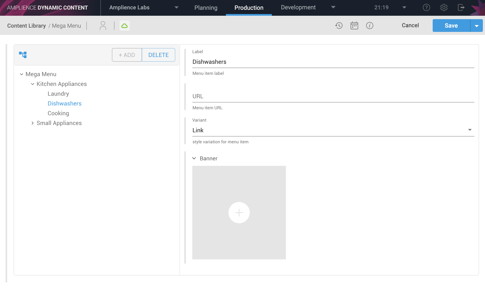

# dc-extension-tree

> Tree field component for use in [Amplience Dynamic Content](https://amplience.com/dynamic-content)



## Usage

This extension can be used to edit a hierarchy of nodes. Each node in the tree has a "type" which maps to a particular node type defined inside the schema.

### Example Schema

```json
{
	"$schema": "http://json-schema.org/draft-07/schema#",
	"$id": "...",

    "title": "Menu",
    "description": "",

	"allOf": [{ "$ref": "http://bigcontent.io/cms/schema/v1/core#/definitions/content" }],
	
	"type": "object",
	"properties": {
		"menu": {
            "type": "array",
            "title": "Menu",
            
            "ui:extension": {
				"url": "https://unpkg.com/dc-extension-tree/build/dynamicContent.browser.umd.min.js"
            },

            "items": {
                "oneOf": [
                    { "$ref": "#/definitions/menu" }
                ]
            }
        }
	},
	"propertyOrder": [],

	"definitions": {
		"menu": {
            "type": "object",
            "title": "Menu",
            "labelField": "label",
            "properties": {
                "type": {
                    "const": "menu"
                },
                "data": {
                    "type": "object",
                    "properties": {
                        "label": {
                            "type": "string",
                            "title": "Label",
                            "description": "Menu label"
                        }
                    }
                },
                "children": {
                    "type": "array",
                    "items": {
						"oneOf": [
							{ "$ref": "#/definitions/menuItem" }
						]
                    }
                }
            }
        },
		"menuItem": {
            "type": "object",
            "title": "Menu Item",
            "labelField": "label",
            "properties": {
                "type": {
                    "const": "menu-item"
                },
                "data": {
                    "type": "object",
                    "properties": {
                        "label": {
                            "type": "string",
                            "title": "Label",
                            "description": "Menu label"
                        }
                    }
                }
            }
        }
	}
}
```

## Advanced

### Node Labels

By default, nodes will be displayed using the “title” field from the node schema. You can also use a field from the node instead as the display label by setting the property “labelField” inside your node schema.

Example:

```json
{
    "type": "object",
    "labelField": "label",
    "properties": {
        "type": {
            "const": "menu"
        },
        "data": {
            "type": "object",
            "properties": {
                "label": {
                    "type": "string",
                    "title": "Label",
                    "description": "Menu label"
                }
            }
        }
  }
}
```

### Validation

To enable validation, pass in an additional parameter “pointer” inside the “ui:extension” params. The pointer should indicate where in the schema the tree field is located, relative to the root of the schema, using a slash separated path.

Example:

```json
{
    "ui:extension": {
        "url": "...",
        "params": {
            "pointer": "/menu"
        }
    }
}
```

### Content Link Cards & Icons

If your schema includes content link fields, the extension will show a default icon when the value is populated. You can override this with either a card or custom icon by providing the following settings:

```json
{
    "ui:extension": {
        "url": "...",
        "params": {
            "contentTypes": {
                "cards": {
                    "<content-type-id>": "https://myapp.com/preview/card?vse={{vse.domain}}&content={{content.sys.id}}"
                },
                "icons": {
                    "<content-type-id>": "https://myapp.com/icons/icon-banner.png"
                }
            }
        }
    }
}
```

You can also use a wildcard “*” to use the same card or icon for every content type:

```json
{
    "ui:extension": {
        "url": "...",
        "params": {
            "contentTypes": {
                "cards": {
                    "*": "https://myapp.com/preview/card?vse={{vse.domain}}&content={{content.sys.id}}"
                },
                "icons": {
                    "*": "https://myapp.com/icons/icon-banner.png"
                }
            }
        }
    }
}
```

## License

Licensed under the Apache License, Version 2.0 (the "License");
you may not use this file except in compliance with the License.
You may obtain a copy of the License at

    http://www.apache.org/licenses/LICENSE-2.0

Unless required by applicable law or agreed to in writing, software
distributed under the License is distributed on an "AS IS" BASIS,
WITHOUT WARRANTIES OR CONDITIONS OF ANY KIND, either express or implied.
See the License for the specific language governing permissions and
limitations under the License.
